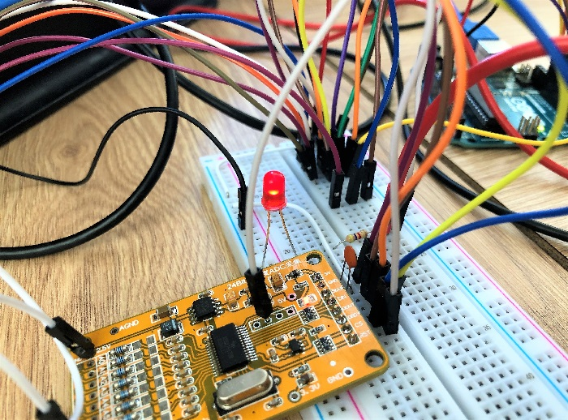
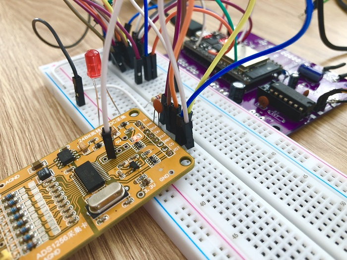

## About

Arduino Library for Texas Instrument ADS1256 supporting Arduino UNO and ESP32. Forked from https://github.com/ADS1xxx-Series-ADC-Libraries/ADS1255-ADS1256 and reworked.

## Arduino UNO

<p align="center">
  
</p>

Select Arduino UNO board in platformio.ini file by commenting out ESP32 part:
```
; [env:esp32]
; platform = espressif32
; board = esp32dev
; framework = arduino

[env:Arduino UNO]
platform = atmelavr
board = uno
framework = arduino
```

# Wiring 🔌
Arduino UNO --- ADS1256 module:
```
MISO (12) --- DOUT
MOSI (11) --- DIN
SCK  (13) --- SCLK
I/O  (10) --- CS
I/O  (9)  --- DRDY
```

Reset is not used in this project. ADS1256 suport 5V (UNO logic levels) tolerant SPI. 30ksps mode is not supported - not enought horsepower 😟

## ESP32 Devmodule

<p align="center">
  
</p>

Select ESP32 board in platformio.ini file by commenting out UNO part:
```
[env:esp32]
platform = espressif32
board = esp32dev
framework = arduino

; [env:Arduino UNO]
; platform = atmelavr
; board = uno
; framework = arduino
```

# Wiring 🔌
ESP 32 dev  --- ADS1256 module:
```
MISO (12) --- DOUT
MOSI (13) --- DIN
SCK  (14) --- SCLK
I/O  (15) --- CS
I/O  (16)  --- DRDY
```

HSPI is used:
```C++
#if   defined(ARDUINO_ARCH_ESP32)
SPIClass spiobject(HSPI);
#endif
```

Reset is not used in this project. 
